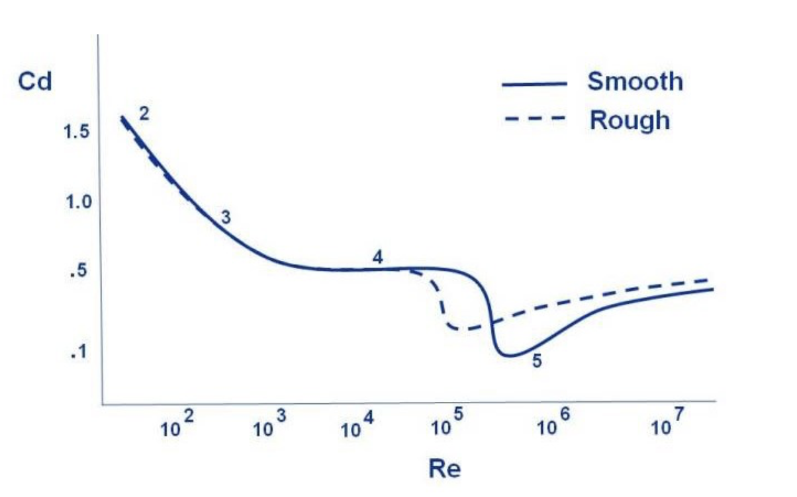
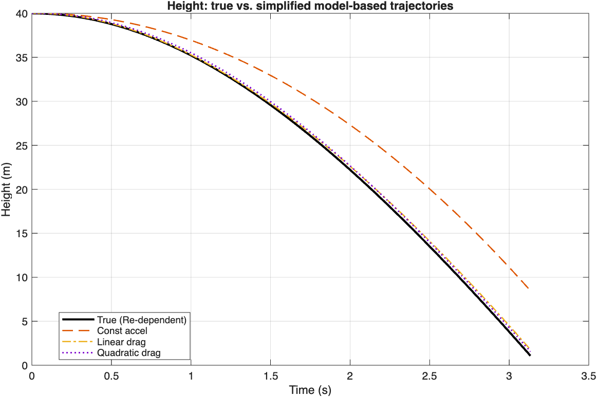
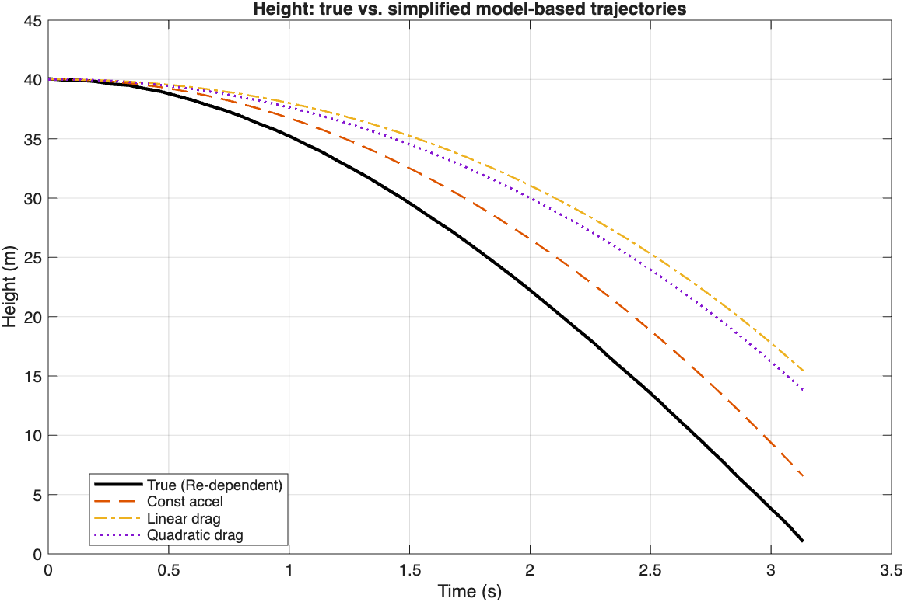
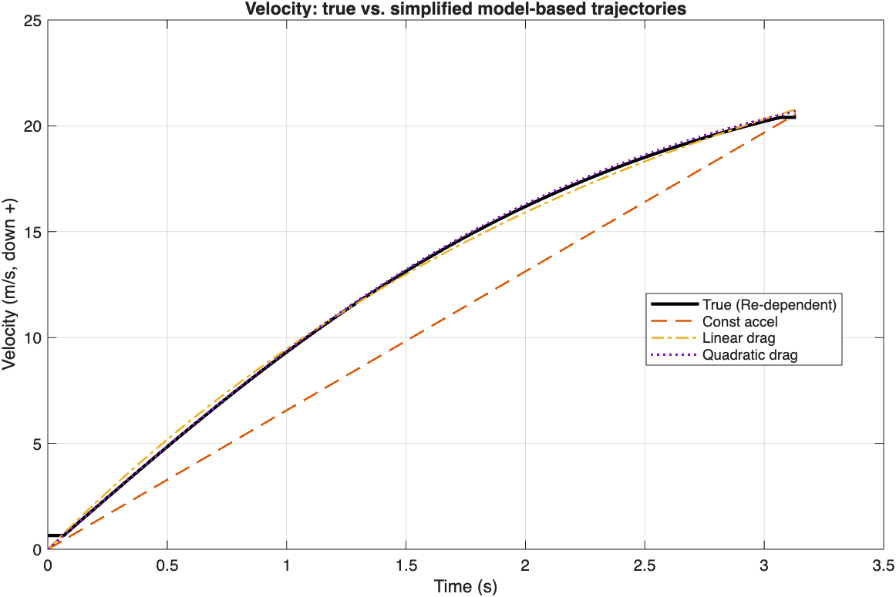
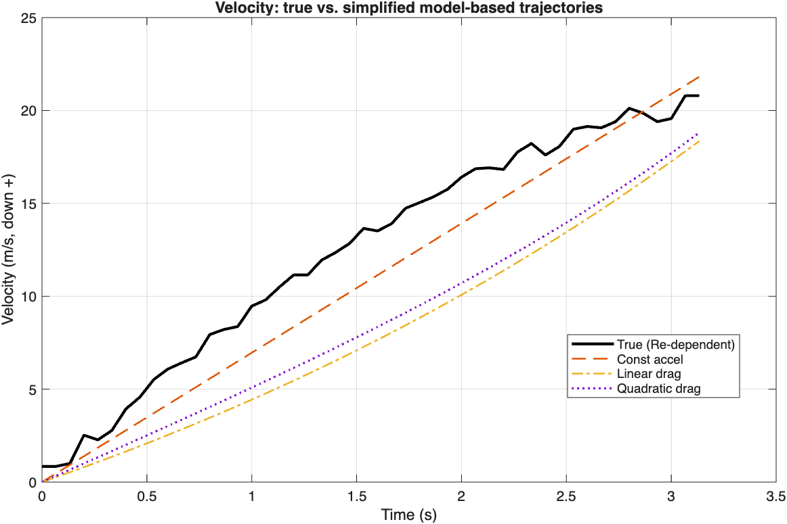

# Nonlinear System Identification via SINDy: Falling-Ball Dynamics

> Investigating the combination of model-based signal processing and data-driven learning for aerodynamic drag identification.  
> Budapest University of Technology and Economics (BME VIK), December 2025  
> Supervisor: Dr. Tamás Dabóczi

---

## Overview

This project applies the **Sparse Identification of Nonlinear Dynamics (SINDy)** framework to identify the governing equations of a falling sphere from simulated height measurements. It benchmarks SINDy-discovered models against classical physics-based baselines (constant, linear, and quadratic drag) to assess where data-driven methods succeed — and where they fundamentally cannot.

The core finding: the true drag law (Brown–Lawler correlation) contains fractional powers, inverse powers, and rational terms in velocity. A polynomial SINDy library is **structurally incapable** of recovering it regardless of data quality or tuning. SINDy converges to the best polynomial surrogate instead — stable and useful for short-term prediction, but not for physical discovery.

---

## Repository Structure

```
sindy-falling-ball/
│
|# MATLAB implementation 
│── MBR.m                        
│── figures/                     # Generated output figures (matlab)
│ 
├── python/                          # Python reimplementation
│   ├── README.md
│   ├── simulate.py
│   ├── sindy.py
│   ├── baselines.py
│   └── requirements.txt
│
└── README.md
```

---

## System: Falling Tennis Ball

A tennis ball is dropped from rest at H₀ = 40 m. The **true dynamics** are governed by Reynolds-number-dependent drag:

$$\dot{v}(t) = g - \frac{\rho A}{2m} C_D(\mathrm{Re}) \cdot v|v|$$

The drag coefficient follows the Brown–Lawler empirical correlation:

$$C_D(\mathrm{Re}) = \frac{24}{\mathrm{Re}}\left(1 + 0.150\,\mathrm{Re}^{0.681}\right) + \frac{0.407}{1 + 8710/\mathrm{Re}}$$



*Brown–Lawler drag coefficient curve — the non-polynomial structure here is why polynomial SINDy cannot recover the true law.*

**Physical parameters:**

| Parameter | Value |
|---|---|
| Gravitational acceleration g | 9.81 m/s² |
| Air density ρ | 1.211 kg/m³ |
| Dynamic viscosity μ | 1.81 × 10⁻⁵ Pa·s |
| Ball radius R | 0.033 m |
| Mass m | 0.0567 kg |
| Cross-section A | πR² |
| Initial height H₀ | 40 m |

---

## Pipeline

```
Dense ODE integration (Δt = 10⁻⁴ s, explicit Euler, terminates at h = 0)
              ↓
  Subsample at 15 Hz via PCHIP interpolation
              ↓
  Optional: add Gaussian height noise (σ ≈ 0.03–0.06 m)
              ↓
  Savitzky–Golay smoothing (cubic poly, window ≤ 35 samples)
              ↓
  Centred finite differences → v̂(t), â(t)
              ↓
     ┌──────────────────────────┐
     │   Model-Based Baselines  │   OLS fit: constant / linear / quadratic drag
     └──────────────────────────┘
     ┌──────────────────────────┐
     │     SINDy Regression     │   Polynomial library in h, v up to degree 3
     │   (STLSQ, δ ∈ [0.05,0.08])│  Column-normalized, iterative thresholding
     └──────────────────────────┘
```

---

## Methods

### Model-Based Baselines

Three classical models fitted to the estimated acceleration via OLS:

| Model | Equation |
|---|---|
| Constant acceleration | `a = a₀` |
| Linear drag | `a = a₀ + b₁v` |
| Quadratic drag | `a = a₀ + b₂v\|v\|` |

Each is then simulated forward from the same initial conditions to compute height and velocity RMSE against the Reynolds-dependent reference.

### SINDy

A polynomial candidate library is constructed in `h` and `v` up to degree 3 — 10 terms:

```
Θ(h,v) = [1, h, v, h², hv, v², h³, h²v, hv², v³]
```

Columns are normalized to unit L₂-norm before regression. **Sequential Thresholded Least Squares (STLSQ)** iteratively zeroes coefficients below threshold δ and refits on surviving terms. Term importance is ranked by L₂-norm contribution:

```
contrib_j = ‖Θ_j(t) · ξ_j‖₂
```

---

## Key Results

### Model RMSE vs. Reynolds-Dependent Reference (noise-free)

| Model | RMSE Height (m) | RMSE Velocity (m/s) |
|---|---|---|
| Constant acceleration | 4.47 | 2.34 |
| Linear drag | 0.39 | 0.24 |
| Quadratic drag | **0.37** | **0.13** |

**Height trajectories — true (Re-dependent) vs. model-based baselines:**

| Noise-free | With noise (σ = 0.03 m) |
|---|---|
|  |  |

**Velocity trajectories — illustrating noise amplification after differentiation:**

| Noise-free | With noise (σ = 0.03 m) |
|---|---|
|  |  |

*Even modest height noise becomes severe corruption in the differentiated velocity signal — a core challenge for SINDy.*

### SINDy Identified Models

**Noise-free** (δ = 0.08):
```
v̇ ≈ 5.44 + 0.159·v + 0.120·h
```

**Noisy** (σ = 0.03 m, δ = 0.08):
```
v̇ ≈ 12.89 + 0.489·v
```

**SINDy candidate function contributions (L₂-norm ranking):**

| Noise-free (δ = 0.05) | With noise σ = 0.03 m (δ = 0.08) |
|---|---|
|  |  |

Both models are sparse and stable across conditions. Noise primarily inflates coefficient magnitudes rather than changing the sparsity pattern. The `h` term in the noise-free case is not physical — it arises from collinearity between height and velocity during free fall and is suppressed once noise raises the effective threshold.

### Why SINDy Cannot Recover the True Law

Substituting Re = ρD|v|/μ = 4416|v| into the Brown–Lawler formula gives CD directly as a function of v:

$$C_D(v) = \frac{0.00544}{|v|}\left(1 + 0.150\,(4416|v|)^{0.681}\right) + \frac{0.407}{1 + 1.97/|v|}$$

This contains inverse powers, fractional powers, and rational terms — none of which are polynomial. The true acceleration law is therefore structurally outside the span of any polynomial library, regardless of degree, noise, or threshold tuning. SINDy returns the best polynomial surrogate it can find, not the underlying physics.

---

---

## Running the MATLAB Code

Requires MATLAB with the **Signal Processing Toolbox** (for `sgolayfilt`). No additional dependencies.

```matlab
% Noise-free run (delta = 0.05) — reproduces Figure 4.2a
run('matlab/MBR.m')

% Noisy run, sigma = 0.03m (delta = 0.08) — reproduces Figure 4.2b
run('matlab/MBR_noisy.m')
```

The script runs end-to-end: simulation → sampling → noise → smoothing → differentiation → model-based baselines → SINDy regression → all figures. Console output prints ranked term contributions.

---

## Python Reimplementation

A Python translation of the core pipeline is available in `python/`. See [`python/README.md`](python/README.md) for setup and usage.

---

## References

1. Brown & Lawler (2003). *Sphere drag and settling velocity revisited.* Journal of Environmental Engineering.
2. Brunton, Proctor & Kutz (2016). *Discovering governing equations from data by sparse identification of nonlinear dynamical systems.* PNAS.
3. Champion et al. (2019). *Data-driven discovery of coordinates and governing equations.* PNAS.
4. de Silva et al. (2020). *Discovery of physics from data: universal laws and discrepancies.* Frontiers in AI.
5. Munson et al. (2013). *Fundamentals of Fluid Mechanics*, 7th ed. Wiley.
6. NASA Glenn Research Center (2020). *Drag of a Sphere.*

---

## Academic Context

**Master's Thesis — Diploma Thesis 1**  
Budapest University of Technology and Economics (BME VIK)  
Department of Artificial Intelligence and Systems Engineering  
**Supervisor:** Dr. Tamás Dabóczi | December 2025
